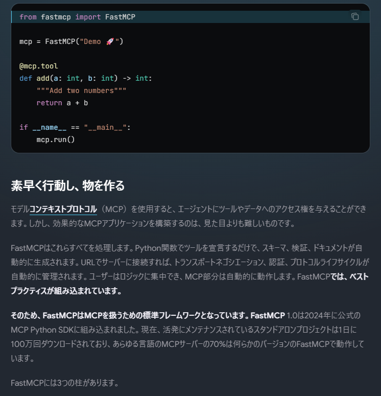
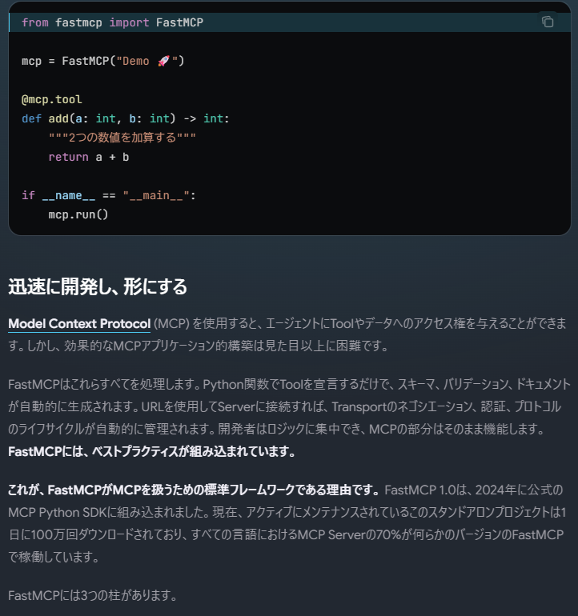
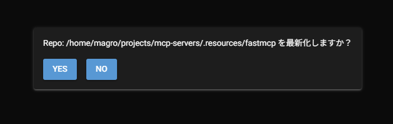

# Fast MCP Servers

FastMCP を勉強しつつ、ついでにドキュメントを翻訳するミニアプリを作りました。  
※ 機能追加中です。

- [FastMCP V3](https://gofastmcp.com/getting-started/welcome)
- [NiceGUI](https://nicegui.io/)
- [LlamaIndex](https://www.llamaindex.ai/)

## 翻訳アプリのコンセプト

まず前提として、FastMCP のドキュメントがローカル環境でプレビュー出来たという点が大きい。  
詳しくは以下を参照してください。

[プレビュー環境の構築方法](./docs/README.md)

プレビューを起動すると、HMR対応らしく、ドキュメントを更新すると即座に反映されます。  
つまり本アプリで「翻訳 → 保存」とすると、即座に翻訳版が反映されて、魔法っぽい動作になります。

LLMを利用すると、翻訳の精度が段違いに上がります。  
※ 課金もそれなりに発生します！  

ブラウザ版の翻訳でリテラル値が前後したり、コードブロック内のコードが翻訳されたり、苦労した経験を持っている方も多いかと思いますが、お金さえかければ納得の仕上がりになるわけです。  

**https://gofastmcp.com/getting-started/welcome**



上記はブラウザで翻訳したものですが、まぁ、このページに関して言えばそれほど酷くはない方です。  
これをLLMで翻訳すると…



どうでしょうか？  
言葉の選び方も技術用語に寄せてあり、コード内のコメントだけを日本語に翻訳しています。  

とはいえ気まぐれなLLMなので、毎回100%納得出来るかと言えば、そうでもない場合もありますが、mdx フォーマットを破壊することなく翻訳してくれるのは実に嬉しい限りなわけです。

※ mdx という事で、なるべく高性能なモデルが必要になります。  
※ 上記は gemini-3.1-pro-preview を利用。

### 提供機能

- 最新化
- 状態
- 翻訳
- 保存

**最新化**機能は、翻訳の元ネタになる FastMCP のローカルリポジトリを最新化します。  
ローカルリポジトリは単に Git pull するだけですが、FastMCP のツールの1つとして提供しています。

**状態**機能は、入力されたURL(本家サイトかlocalhost)の対象となる mdx ファイルの更新状況を確認する機能です。  
コミット日時がプレビュー版のファイル更新日時より新しい場合は、更新した方が良いですよ？という指標になります。  
※ 雑な判断ですが…。
こちらもツールとして提供しています。

**翻訳**機能こそ、最もLLMのパワーが必要な部分です。  
こちらもツールにて提供していますが、エージェント(UIアプリ)側に実装すべき？とも言える微妙な立場です。  
FastMCP の Sampling 機能を試したかっただけという理由で、ツールとして実装しています。

**保存**機能は翻訳結果をプレビュー側のリソースに保存するだけの機能です。  
こちらも FastMCP の Elicitation 機能を利用して、いわゆる Human in the Loop を実現しています。

## 実装のポイント(LLM)

LLM をどう使うか？という点については非常に悩ましいところです。  
ぶっちゃけ言えば、「翻訳」意外で LLM を使うべきポイントはないとも言えるわけです。  

とはいえ MCP を介することで、ロジック的な部分をなるべくサーバ側に実装して、UI(アプリ)側でどこまで実装を軽く出来るか？...
言いかえるとLLMの自律的な判断力をどこまでアプリの機能として使えるか？といった部分に関して意識しながら実装してみました。

### URLの検証

仕様としては非常に明確なので、実際のところプログラムで判断した方が早いわけですが、あえてプロンプトを使ってLLMに判断させています。  

- [URL検証プロンプト](./servers/ojisan/prompts/url_validator.py)

### ツール利用の判断

どのツールを実行するか？をなるべく曖昧な指示で LLM に判断させています。  
ベースとなるのは以下のプロンプトです。

- [ツールエージェントプロンプト](./servers/ojisan/prompts/tool_agent.py)

このベースの上にユーザの要求という形で、別途プロンプトを埋め込んでいます。

- [ファイルの状態確認用プロンプト](./servers/ojisan/prompts/file_inspect.py)
- [翻訳実行用プロンプト](./servers/ojisan/prompts/file_translation.py)
- [リポジトリ最新化用プロンプト](./servers/ojisan/prompts/update_local_repository.py)

これらのプロンプトも FastMCP の Prompts コンポーネントを使って提供しています。  
本来の使い方はユーザが書いたプロンプトを保存しておき、それを再利用しようぜ？みたいな事だとは思いますが、
このツールを使うにはこのプロンプトを使って！みたいな使い方もありなのかもしれません。  
※ プロトコル的な構造を設計できれば、もう少し面白い使い方が出来そうな気がしないでもないです。

### 翻訳(Sampling)

この Sampling という機能はなかなか面白いというか、カオスというか、とてつもない可能性を秘めているようでもあり、混ぜるな危険みたいな匂いすらします。  
ツール(MCP)側からUI(アプリ)が管理する LLM に逆問い合わせするという、なんとも恐ろしい機能です。  
本当に恐ろしいのは、その Sampling でも Tool を提供できるという事であり、ツールの向こう側のツールが Sampling してたら、さらにツールがあって…という無限地獄に突入することです。  
※ しかし可能性を感じる魅力的な機能でもある。

LLM の利用はそれなりに課金されるので、「MCP 側ではなく使う側が負担しろや！」みたいな事が主な目的かもしれません。
という事もあり、LlamaIndex の MCP クライアントでは非対応でした。

しかし FastMCP のクライアントは対応しているので、「何とかなるんじゃね？」という気持ちでマニアックなハックをしてしまいました。  
目的は違うにしろ、今回のハックと同じようなことを実現したい、または実現した人はいるのではないかな？といった気がしますので、何らかの参考になるのではないかと。

- [mcp client](./app/obasan/workflows/mcp_client.py)

LlamaIndex の MCP クライアントでツールのリストを取得し、その内容を精査しつつ、特定のツールに対してツール実行となる関数を合法的？に挿しかえるという方法です。  
挿しかえた関数では FastCMP のクライアントでツールを実行して結果を返します。  

```python
P = ParamSpec("P")
R = TypeVar("R")

def mcp_sampling_bridge(tool_names: set[str]):
    """
    MCP の特定の Tool 呼び出しで Sampling 対応の FastMCP Client へ差し替えます
    """

    def decorator(func: Callable[P, Awaitable[R]]) -> Callable[P, Awaitable[R]]:
        """
        Decorator
        """
        @wraps(func)
        async def wrapper(*args: P.args, **kwargs: P.kwargs) -> R:
            tools = await func(*args, **kwargs)
            for i, tool in enumerate(tools):
                if isinstance(tool, FunctionTool):
                    if tool.metadata.name in tool_names:
                        # async_fn を差し替えることで、client を sampling 対応に変更できる。
                        async def wrapper_fn(*args: Any,  _name = tool.metadata.name, **kwargs: Any):
                            async with get_mcp_client() as client:
                                return await  client.call_tool(_name, kwargs)

                        # FunctionTool を再生成させる。
                        tools[i] = FunctionTool.from_defaults(
                            tool_metadata=tool.metadata,
                            async_fn=wrapper_fn,
                            fn=tool.fn,
                            partial_params=tool.partial_params,
                            callback=tool._callback,
                            async_callback=tool._async_callback,
                        )

            return tools
        return wrapper
    return decorator

@mcp_sampling_bridge(tool_names={"DocumentTranslator", "UpdateLocalRepository"})
async def get_tools() -> list[FunctionTool]:
    """
    MCP から Tool リストを取得する。
    """
    client = get_client()
    mcp_tool_spec = McpToolSpec(client=client)
    return await mcp_tool_spec.to_tool_list_async()
```

FastMCPのクライアントにはハンドラが設定出来るので、以下のような感じでハンドラを設定するだけです。  
GoogleGenAI 用のハンドラが用意されてました(ラッキー)。

```python
def get_mcp_client() -> Client:
    """
    FastMCP Client
    """
    global _mcp_client
    if isinstance(_mcp_client, Client):
        return _mcp_client

    _mcp_client = Client(
        transport=os.getenv("MCP_SERVER_TRANSPORT", "http://localhost:8000/mcp"),
        # Sampling のハンドラ
        sampling_handler=GoogleGenaiSamplingHandler(
            default_model=os.getenv("GEMINI_FLASH_LITE_MODEL", "gemini-3.1-flash-lite-preview")
        ),
        # Elicitation のハンドラ
        elicitation_handler=elicitation_handler,
    )

    return _mcp_client
```

## 実装のポイント(UI)

今回使ってみた NiceGUI ですが、Python だけで UI も全部書いてしまおう！みたいなコンセプトなのかと思います。  
※ Laravel の Livewire に近いかな？
Streamlit と違い、ネイティブに Human in the Loop が実装出来てしまうのはポイントが高いとも言えます。  

内部的には Vue の最強フレームワークである Quasar を使っており、コンポーネントの props あたりは同じような感覚で使える？こともあります。  
とはいえ Python なのでリアクティブ機能に関しては過度な期待はしてはいけません。  
websocket を使って頑張って UI の DOM を書き換えてる臭いので、ネイティブな Vue(Quasar) アプリよりも描画パフォーマンスはかなり落ちるのかと思います。  

またロジックとUI管理の依存関係に関しても、どうにもならないくらい密結合しやすいケースもあります。  
今回はなるべくストア(Pydantic model)を仲介しつつ UI のリアクティブな更新をするようにしてみましたが、思ったように動く場合もあれば、動かない場合もありました。

Streamlit はその設計コンセプトによりステート管理が重要になりますが、NiceGUI は UI コンポーネントの配置方法に慣れてくれば、あとは比較的直観的な実装が可能です。  

### Dialog + Human in the Loop

ネイティブに Human in the Loop が実装出来るのはかなりの強みになります。  
今回ではローカル内の FastMCP リポジトリの最新化、翻訳結果のファイル保存において HITL を実装してみました。  
基本的に人間による最終判断という介入を果たす必要がある場合に、非常に重要な機能となるわけです。

なお、LlamaIndex の MCP クライアントはこれに非対応でして、Sampling と同じように FastMCP クライアントを利用します。  
ここでも上記のハックが再利用できるわけです。



MCP からの Elicitation 実行は非常にシンプルです。  
依存注入により Context を受け取り、elicit メソッドを呼ぶだけです。

```python
@mcp.tool(
    name="UpdateLocalRepository",
    tags={"documentation"},
    timeout=30.0,
    version="1.0.0"
)
async def update_local_repository(
    context: Context,
    config: RootConfig = Depends(get_config)
) -> SimpleResponse:
    """
    FastMCPのローカルリポジトリの最新化を行うツールです。
    """
    # ユーザに最新化の最終確認する。
    response = await context.elicit(
        message=f"Repo: {config.docs.original_repo} を最新化しますか？",
        response_type=None,
    )

    # キャンセル
    if response.action != "accept":
        return SimpleResponse(success=False, message="Update cancelled")

    res = GitHelper.update_repository(config.docs.original_repo)
    if not res:
        return SimpleResponse(message="Failed to update docs")

    return SimpleResponse(
        success=True,
        message=f"{res}"
    )
```

UI(アプリ)側では例のごとく FastMCP クライアントにハンドラを設定します。  
`response_type` や複雑な `params` 構造とすれば、もう少し面倒な実装にもなりますが、今回は Yes/No だけの問い合わせなのでシンプルです。

```python
async def elicitation_handler(
    message: str,
    response_type: type | None,
    params: ElicitRequestParams,
    context: RequestContext
) -> ElicitResult | object:
    """
    User Elicitation のハンドラ
    いわゆる Human-in-the-loop
    本来であれば、response_type や params を見ながら、UIを構成するべきである。
    """

    # 今回は簡易的なダイアログで対応する
    user_input = await show_dialog(message)
    # 承諾
    if user_input == "Yes":
        return ElicitResult(action="accept")
    # 拒否
    if user_input == "No":
        return ElicitResult(action="decline")
    # キャンセル
    return ElicitResult(action="cancel")
```

ダイアログコンポーネントも比較的シンプルです。  
MCP からのメッセージをストア経由で bind してあげるのがポイントでしょうか。

```python
_dialog = Dialog

def elicitation_dialog_component():
    """
    Dialog Component
    """
    global _dialog
    with ui.dialog() as dialog, ui.card():
        ui.label().bind_text_from(
            target_object=dialog_store,
            target_name="message"
        )
        with ui.row():
            ui.button(text="Yes", on_click=lambda: dialog.submit("Yes"))
            ui.button(text="No", on_click=lambda: dialog.submit("No"))
    _dialog = dialog

async def show_dialog(message: str):
    """
    ダイアログを表示して回答を待つ
    """
    global _dialog
    dialog_store.message = message

    return await _dialog # type: ignore
```

これだけで HITL が実装できるのは非常にありがたい事ですね。  
